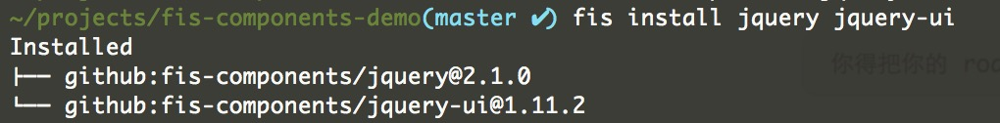
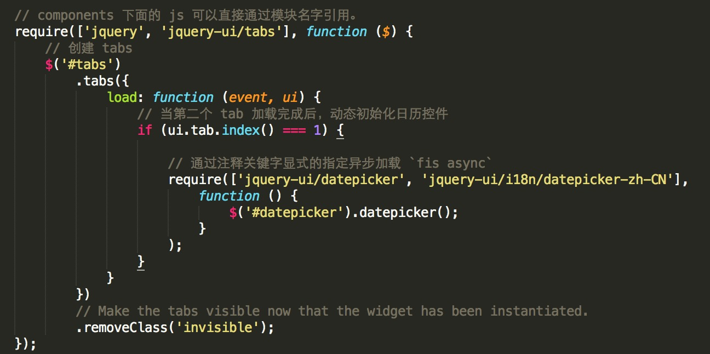

FIS 组件生态
===========




[Demo](https://github.com/fex-team/fis-components-demo)

## 背景

目前互联网上已经存在大量成型的第三方组件，我们为什么不直接在fis中使用呢？虽然各类插件规范可能不一致，FIS-Components帮你统一规范，简单化使用方式！

## 像开发 node.js 一样开发网页应用

fis install 类似与 npm install，把现有的组件安装到当前项目。

```
$ fis install jquery bootstrap

Installed
├── github:fis-components/jquery@1.9.1
└── github:fis-components/bootstrap@v3.3.1

```

无需任何配置直接就能这样使用。

```javascript
require('bootstrap/button');
var $ = require('jquery');


$('.btn').click(function() {
    alert('Magic');
});
```

还记得 fis 的三种语言能力吗？同样直接可以用这种路径。`{组件名字}/{资源在组件中的路径}`。


## 为什么不直接使用 bower？

个人觉得有以下几个原因，导致 bower 不适合 fis。

1. bower 包没有严格的存放规范，每个包的引用方式都可能不一样。冗余的文件多，影响编译性能。于是，我们制定了更严格的[规范](https://github.com/fis-components/spec), 同时我们把不必要的文件去掉了。
2. 大部分组件采用 amd/umd 规范，在 fis 的 mod.js 中不能直接使用。于是，我们的组件平台集成了转换工具，自动将 amd/umd 转成 commonJS。
3. 有的组件我们希望是私有的，部门级别的共享，bower做不到。于是，我们的组件安装可以指定多种平台，可以直接安装来自 github、gitlab 或者 lights 上的组件。
4. fis 开发中还有一些特有的东西，比如可公用的 smarty、velocity 模板，放在共有平台没意义。

## 为什么选择 commonJs 规范？

目前比较流行组件规范有 AMD 、CommonJs  和 UMD 三种（[什么是 amd commonjs umd?](http://davidbcalhoun.com/2014/what-is-amd-commonjs-and-umd/)）, AMD 和 UMD 居多，而我们的选择是最简单的 CommonJs 规范与 node.js 采用的保持一致。

AMD 和 UMD 扩展自 CommonJs 规范，主要为了适用于浏览器。 而在 fis 的开发环境中，我们直接就能使用 CommonJs 规范。而且目前已被 mod.js 方案采用，广泛应用于厂内各大产品。

## 如何同步现有流行组件？

现状：大量现有第三方组件采用的要不是 AMD，要不就是 UMD，而我们选择的是 CommonJs 规范，如何去适配现有的这次组件？

通过简单的配置，结合 travis CI, 代码一提交就会自动把现有 AMD 或者 UMD 的组件转换成 CommonJs。

目前此机构下面的组件都来源于[这些配置文件](https://github.com/fis-components/components/tree/master/modules), 欢迎大家提 pull request 丰富我们的组件平台。


## 支持强大的 [semverion](https://github.com/npm/node-semver)

当我们使用某个第三组件时，我们希望使用的是一个比较稳定的版本，对方大的版本更新不希望更新到，同时如果有什么小瑕疵，希望又能及时更新到。如何设置？

目前第三方库都有这么个约定，小问题修复都是发布新的小版本号，大的改动会发布大的版本号。我们只需要设置大版本号下最新的小版本就能满足这个需求。

比如：

* jquery@~1.9.2 将会安装 >=1.9.2 && <1.10.0 中的最新一个版本。
* jquery@^1.9.2 将会安装 >=1.9.2 && <2.0.0 中的最新一个版本。

## 详情

* [FIS 组件安装](./install.md)
* [FIS 组件使用](./useage.md)
* [FIS 组件平台建设](./platform.md)
